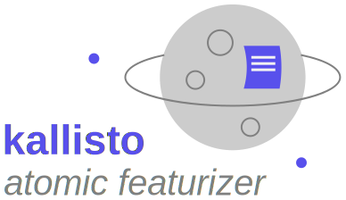

<div align="center">

</div>

##


[](https://app.gitbook.com/@ehjc/s/kallisto/)
[](https://img.shields.io/badge/Maturity%20Level-ML--1-orange)
[](https://github.com/AstraZeneca/kallisto/actions?workflow=Tests)
[](https://codecov.io/gh/AstraZeneca/kallisto)
[](https://lgtm.com/projects/g/AstraZeneca/kallisto/context:python)
[](https://joss.theoj.org/papers/16126cbcfb826bf4810d243a009a6b02)

# Table of Contents

- Full Author List
- Introduction
- Installation
- Testing suite
- Reference

# Full Author List

- Developer [Eike Caldeweyher](https://scholar.google.com/citations?user=25n8C3wAAAAJ&hl=de)
- Developer [Philipp Pracht](https://scholar.google.com/citations?user=PJiGPk0AAAAJ&hl=de)

# Introduction

We developed the `kallisto` program for the efficient and robust calculation of atomic features using molecular geometries either in a ``xmol`` or a ``Turbomole`` format.
Furthermore, several modelling tools are implemented, e.g., to calculate root-mean squared deviations via quaternions (including rotation matrices), sorting of molecular geometries and many more. All features of ``kallisto`` are described in detail within our [documentation](https://app.gitbook.com/@ehjc/s/kallisto/) ([GitBook repository](https://github.com/f3rmion/gitbook-kallisto)).

Main dependencies
-----------------

```bash
click 7.1.2 Composable command line interface toolkit
numpy 1.20.1 NumPy is the fundamental package for array computing with Python.
scipy 1.6.0 SciPy: Scientific Library for Python
└── numpy >=1.16.5
```

For a list of all dependencies have a look at the pyproject.toml file.

Installation from PyPI
----------------------

To install ``kallisto`` via `pip` use our published PyPI package
```bash
pip install kallisto
```

Installation from Source
------------------------

Requirements to install ``kallisto``from sources:
- [poetry](https://python-poetry.org/docs/#installation)
- [pyenv](https://github.com/pyenv/pyenv#installation) or [conda](https://docs.conda.io/projects/conda/en/latest/user-guide/install/index.html)
- python >=3.7

First check that ``poetry`` is running correctly (v1.0.10 at the time of writing)

```bash
> poetry --version
Poetry version 1.0.10
```

Create a virtual environment (via ``pyenv`` or ``conda``) and activate it. Afterwards, clone the ``kallisto`` project from GitHub and install it using ``poetry``

```bash
> git clone git@github.com:AstraZeneca/kallisto.git
> cd kallisto
> poetry install
```

Testing suite
-------------

The ``kallisto`` project uses [nox](https://nox.thea.codes/en/stable/tutorial.html#installation) as an automated unit test suite, which is therefore an additional dependency.

### Default nox session

The default session includes: linting (lint), type checks (mypy, pytype), and unit tests (tests). 

```bash
> nox
```

When everything runs smoothly through, you are ready to go! After one successful nox run, we can reuse the created virtual environment via the ``-r`` flag.

```bash
> nox -r
```

Different unit test sessions are implemented (check the noxfile.py). They can be called separately via the run session ``-rs`` flag.

### Tests

Run all unit tests that are defined in the /tests directory.

```bash 
> nox -rs tests
```

### Lint

``kallisto`` uses the [flake8](https://flake8.pycqa.org/en/latest/) linter (check the .flake8 config file).

```bash
> nox -rs lint
```

### Black

``kallisto`` uses the [black](https://github.com/psf/black) code formatter.

```bash 
> nox -rs black
```

### Safety

``kallisto`` checks the security of dependencies via [safety](https://pyup.io/safety/).

```bash
> nox -rs safety
```

### Mypy

``kallisto`` checks for static types via [mypy](https://github.com/python/mypy) (check the mypy.ini config file).

```bash
> nox -rs mypy
```

### Pytype

``kallisto`` furthermore uses [pytype](https://github.com/google/pytype) for type checks.

```bash
> nox -rs pytype
```

### Coverage

Unit test [coverage](https://coverage.readthedocs.io/en/coverage-5.4/) can be checked as well.


```bash
> nox -rs coverage
```

Reference
---------

tba
